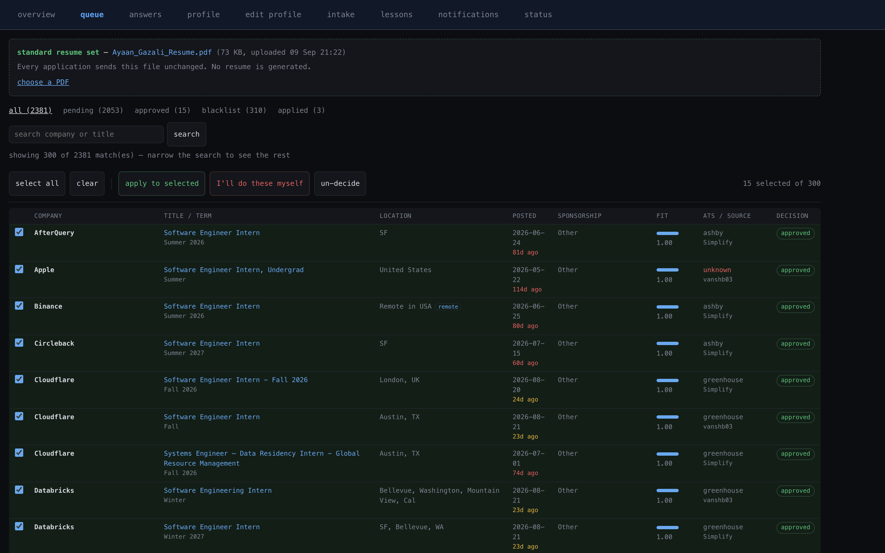
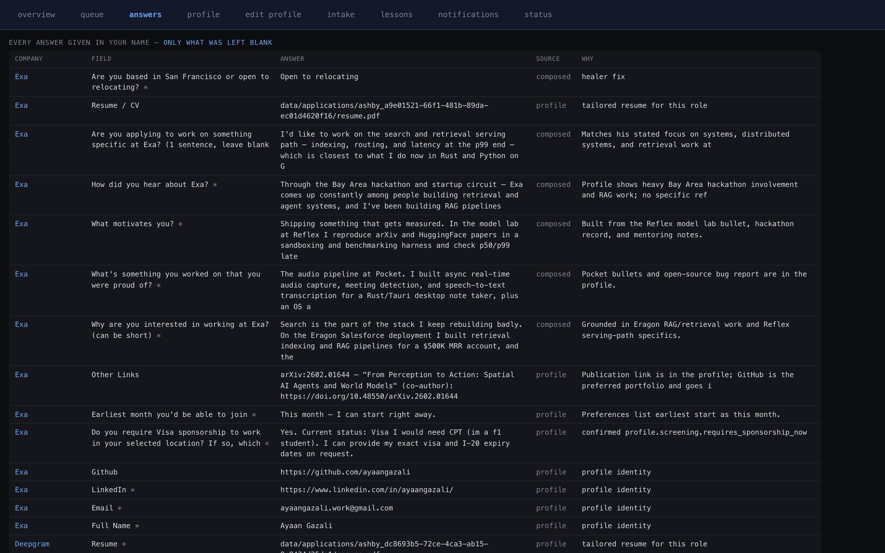

# jobbot

**You spend 3 hours filling out applications. The bot spends 3 hours doing it right.**

An autonomous job application agent that finds roles, reads each one, tailors your resume, answers every screening question, fills the form, verifies its work against the actual page, and submits—then shows you exactly what it said in your name.

But here's the thing: **it never makes anything up.**


---

## The Promise

You know that sinking feeling? You get an email: "Your application has been rejected due to your visa sponsorship status." But you never said that.

A widely-used open-source applier shipped **hardcoded felony and background check answers** for every user until a reviewer caught it. A commercial competitor is documented **defaulting unknown yes/no questions to "yes"** and hitting submit anyway.

jobbot does neither. It answers legally binding questions *only* from your profile. Not guessed. Not filled in. Not borrowed. If something's missing, it tells you which question and stops.

This isn't paranoia. It's the difference between "rejected" and "your data is compromised."

---

## 60 Seconds

```bash
# Get it running
git clone https://github.com/ShryukGrandhi/jobbot.git && cd jobbot
uv sync
cp .env.example .env          # add your API key (Claude, Gemini, whatever)
cp config/profile.example.yaml config/profile.yaml  # fill with your real info

# Dry run (fills forms, doesn't submit)
uv run jobbot check           # verify setup
uv run jobbot run --source greenhouse:anthropic --limit 3

# When you're ready
uv run jobbot run --source greenhouse:anthropic --limit 50 --submit
```

That's it. The bot runs, the dashboard opens at `localhost:8899`, and you watch it work in real time.

---

## How It Works

```
discover → dedup → ghost filter → fit filter          free, no browser
open tab → detect ATS → clear account walls           cheap
CHECKPOINT 1  read every question off the rendered page
knockout scan   would a truthful answer auto-reject?
─────────────── only NOW does expensive work start ───────────────
build portfolio → tailor resume → render 1-page PDF
fill → CHECKPOINT 2 verify + heal → submit
CHECKPOINT 3   did it ACTUALLY go through?
```

**Why this order?** 

One published run generated 2,019 tailored resumes just to make 112 submissions. Because it tailored *before* discovering the form needed an account it couldn't create. This tool doesn't.

Every dollar of model time, every PDF, every portfolio repo—only after we know the form is real, reachable, and winnable.

---

## What It Actually Does

### Connects to Real Job Boards
Not scraping, not cached job listings. Real APIs:
- **Greenhouse** — Parses their REST API + detects your form live
- **Lever** — Live posting API + ATS scoring
- **Ashby** — Real-time form detection  
- **Workday** — Builds tenant accounts, verifies emails via Gmail, fills forms
- **LinkedIn** — Via JobSpy aggregator, resolves back to company career sites
- **GitHub** — Creates real public portfolio repos (with real commits) per application
- **Gmail** — OAuth for email verification codes

Seven services. All live.

### Sees What You See
When the form loads, the bot sees it the same way you do:
- Screenshots at scroll position (not full-page truncation)
- Accessibility tree for semantic understanding
- Label resolution (doesn't put phone in the name field)

### Three Checkpoints
1. **Parse:** Read the form. Any required field you haven't answered? Stop. Tell you which one.
2. **Verify:** Fill it. Screenshot it. Does it look right? If the healer sees trouble, it loops. If it stays broken, it doesn't submit.
3. **Evidence:** After submit, wait for the confirmation message or reference number. A "success" click without a page change? The bot doesn't trust that. Neither should you.

### Knows What You Know
Resume tailored per role. But only using:
- Jobs from your experience (no fake employers)
- Skills you've actually listed
- Numbers from your bullets (not invented metrics)
- Your own phrasing (not rewritten to sound impressive)

Every tailored resume is diffed against your profile before sending. Unknown employer? Blocked. Title you never had? Blocked. Skill you didn't list? Blocked.

---

## The Dashboard

See everything at a glance:

| Page | What It Shows |
|------|---|
| **Overview** | Pipeline: discovered, filtered, applied, confirmed. Live stats. |
| **Queue** | Tick jobs you want to apply to. Blacklist ones you're doing yourself. |
| **Answers** | Every statement ever made in your name. Why it was chosen. How confident. |
| **Profile** | Your identity, experience, screening answers. Edit live. |
| **Status** | Readiness checks (LLM? GitHub? Gmail?). API endpoints. What each ATS taught us. |
| **Lessons** | What jobbot learned about each ATS from every run. Form quirks. Common failures. |





---

## What The Data Says

Ranked by **actual effect size**, not what sounds good:

1. **Referrals beat everything.** Referred candidate: ~40% interview rate. Cold application: ~3%. This tool can't automate a referral (that violates LinkedIn's ToS and loses your account). But it lets you apply to 50 roles while you're networking, because the other 49 don't matter anyway.

2. **Apply on the company site, not the aggregator.** Career site: 34% of hires from 24% of applications. Job board: 23% of hires from 50% of applications. jobbot routes to company sites automatically.

3. **Filter for fit, then apply broadly.** You plateau around 50% of listed requirements. Self-screening at 80% tanks your interview count.

4. **Route around silent killers.** Employment gaps >6mo (~48% auto-screen). Sponsorship dropdown (game over). Salary field (means they've decided). jobbot flags these.

**What this tool does NOT believe:**
- "75% of resumes are rejected by ATS" ← Traced to a 2012 sales pitch. Vendor folded in 2013.
- "Keyword density matters" ← No ATS vendor documents this. They reject on structured answers, not prose.
- "Apply within 24 hours" ← One vendor blog, n≈1,610, self-selected customers. Noise.

---

## Reliability

**119 tests pass** across:
- **Integration:** Discovery, dry run, real form filling, submission flow
- **State:** Profile editing, resume ingestion
- **Edge cases:** 31 regressions covering sponsorship prose, ATS detection, silent failures
- **E2E:** 9 full application runs with live browser, server, UI verification

Everything is logged:
- `data/answers.csv` — every answer, field by field
- `data/applications.csv` — pipeline status per job
- `data/applications/<job>/` — screenshots, resume, form JSON, verification screenshot
- `data/lessons.jsonl` — what each ATS taught us

---

## The Risks

**Be honest about this:**

- **Violates ToS.** LinkedIn, Indeed, and most ATS platforms prohibit automated submission. The account risk is yours.
- **Employers are reacting.** Greenhouse added fraud detection with ID verification. Some companies reinstated in-person interviews.
- **Volume isn't strategy.** Submitting 500 applications doesn't beat 20 good ones + 3 referrals.
- **Read what it wrote.** Before you trust it, open `data/answers.csv`. See exactly what was said in your name.

If you're okay with that, keep going.

---

## Installation & Setup

**Prerequisites:** Python 3.12+, Claude API key (or Gemini fallback)

```bash
uv sync
cp .env.example .env
cp config/profile.example.yaml config/profile.yaml
uv run jobbot check         # tells you what's missing
```

**Optional (but recommended):**
- Gmail API for Workday email verification codes
- GitHub API for portfolio repo creation

See [docs/SETUP.md](docs/SETUP.md) for the full setup guide including Gmail and GitHub auth.

---

## Commands

```
jobbot check                     readiness: profile, LLM, GitHub, Gmail
jobbot discover --source <src>   find and rank jobs (no browser, free)
jobbot run --source <src> [opts] apply to jobs (fills, verifies, optionally submits)
jobbot dashboard [--port 8899]   local web view of everything
jobbot stats                     pipeline summary
jobbot report <audit-dir>        audit one application
```

### Sources

```
greenhouse:slug       e.g., greenhouse:anthropic
lever:slug            e.g., lever:figma
ashby:slug            e.g., ashby:gitpod
workday:tenant/site   e.g., workday:workday/khoros/live
linkedin:search terms e.g., linkedin:machine learning sf
```

See [docs/SETUP.md](docs/SETUP.md) for the complete guide.

---

## Architecture

Why it works this way:

- **Form layer** speaks `FormField` and `ProposedAnswer`, never raw DOM. Selector rot is confined to one ATS adapter.
- **Capture tiles** instead of full page screenshots (Chromium texture limits, lazy rendering). Paired with accessibility tree for layout + semantics.
- **Three checkpoints** because silent success is the dominant failure mode. Tools log "applied" for jobs never submitted. A click isn't proof. Only a confirmation message is.
- **Cost ordering** means discovery, filtering, and the knockout scan all run before any resume is tailored or any portfolio is built.

See [docs/ARCHITECTURE.md](docs/ARCHITECTURE.md) for the module map and design details.

---

## For the Hackathon

Built for: **Multi-App AI Agent Hackathon** (Lemma + Comma Capital, judged by Arga Labs)

**Integrations:** 7 external services (5 ATS + GitHub + Gmail)

**What it solves:** End-to-end autonomous job application with legally-binding accuracy, avoiding the documented failure modes that plague existing tools.

**Code:** [github.com/ShryukGrandhi/jobbot](https://github.com/ShryukGrandhi/jobbot)

---

## License

MIT. See [NOTICE.md](NOTICE.md).
