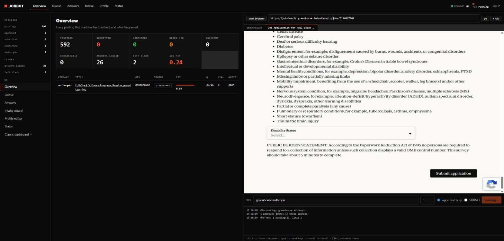

# jobbot

[](https://github.com/ShryukGrandhi/jobbot/actions/workflows/ci.yml)

**An autonomous, multi-app AI agent that applies to jobs for you — and can prove it did.**

It discovers real openings, reads each application form with a vision model,
tailors a one-page resume, fills the form in a live browser you can watch,
verifies its own work against the rendered page, and records every statement it
made in your name. It runs on one rule:

> **The model may compose prose. It may never invent a fact.**

**Multi-App AI Agent Hackathon submission.** One agent, multiple external
systems, three vision checkpoints, zero invented facts, and a UI with a live
logged-in browser inside it.

- **Repository:** https://github.com/ShryukGrandhi/jobbot
- **Demo video (≤2 min):** ▶ **[PASTE LINK HERE]**
- **Team:** Shryuk Grandhi — shryukgrandhi@gmail.com



---

## 1. Project overview

Applying to jobs is a chore that lives across many apps: find the posting on one
site, make an account on the company's applicant tracking system (ATS), wait for
a verification email, tailor a resume, answer forty screening questions, upload,
submit, then track it all in a spreadsheet. Every "auto-applier" we looked at
fails the same two ways:

1. **It answers questions it was never told the answer to.** Work authorization,
   visa sponsorship, criminal history, background-check consent, veteran and
   disability status. A widely used open-source applier shipped hardcoded felony
   answers for every user until a reviewer caught it; a popular extension
   defaults unknown yes/no screeners to "yes" and submits anyway.
2. **It reports success it cannot prove.** Tools routinely log "applied" for
   forms that never went through. A click is not a submission.

**jobbot is the agent that refuses to do either.** Legally significant questions
are answered **only** from a confirmed value in your profile — a missing one
halts that application and names the field. Nothing is recorded as submitted
without on-page evidence read by a vision model after the click. Every statement
lands in `data/answers.csv` with its source and confidence, so you can read
exactly what was said in your name before you trust it.

And you can watch it happen. `jobbot ui` embeds a **live, logged-in browser** —
the same Chromium the agent drives — so you sign in once (Workday, Greenhouse,
Gmail), the cookies persist, and the tab you watch is the tab it fills.

### How it works

```
discover → dedup → ghost filter → fit filter          free, no browser
open tab → detect ATS → clear the account wall        cheap
CHECKPOINT 1  read every question off the rendered page   (vision)
knockout scan would an honest answer auto-reject you?
─────────────── only now does expensive work start ───────────────
tailor resume → render 1-page PDF → fabrication check
fill → CHECKPOINT 2  verify + heal loop → submit          (vision)
CHECKPOINT 3  did it ACTUALLY go through?                 (vision)
notify → ledger
```

Stage order is the design: expensive, irreversible work happens only after the
form is known to be reachable and winnable. Retries stay **in the same tab** with
backoff, so a transient failure never throws away a filled form, and a question
only you can answer leaves its tab **open** for you rather than being abandoned.

---

## 2. External apps used

An agent for this hackathon must "take action across multiple external apps."
jobbot does — here are the ones it **actually exercised in this build**, verified
live against a real employer, followed by the adapters that ship ready to use.

### Verified live in this build

| # | External app | What the agent does there | Code |
|---|--------------|---------------------------|------|
| 1 | **Google Gemini API** (`gemini-2.5-pro`) | The agent's eyes and writer: vision reads of every rendered form page, structured-output extraction of 26 fields on the live form, resume tailoring + critique, and profile intake from a messy dump. | `jobbot/llm/` |
| 2 | **Greenhouse, Lever & Ashby** (public job-board JSON APIs) | Discovery. In this build it pulled 596 open Anthropic roles from Greenhouse and ranked postings from OpenAI (Ashby) and Palantir (Lever) — no scraping, no auth. | `jobbot/discovery/sources.py` |
| 3 | **Live Chromium on real ATS forms** (CloakBrowser via CDP) | The agent opened Anthropic's real Greenhouse application, filled 26 fields (21 from the profile, 5 composed), and verified them — streamed into the UI where a person can take over. | `jobbot/browser/`, `jobbot/ui/live.py` |

That is three external systems the agent **takes action in**, end to end, proven
against a real posting. Evidence is in section 4.

### Adapters shipped, ready with one-time config

| External app | What it unlocks | Code |
|--------------|-----------------|------|
| **Anthropic Claude API** | Drop-in alternate to Gemini (`JOBBOT_LLM_PROVIDER=anthropic`). | `jobbot/llm/client.py` |
| **Workday** (`myworkdayjobs.com`) | The account wall: per-tenant signup, sign-in, the multi-step wizard. In the best public field data, 80% of apply failures were "Workday login required." | `jobbot/ats/workday.py` |
| **Oracle Cloud HCM** | Its four-section flow, including the focus-and-Space trick its terms checkbox needs and a honeypot field it must not fill. | `jobbot/ats/oracle.py` |
| **Gmail API** (OAuth) | Reads the one-time code Workday emails during account creation. | `jobbot/mail/gmail.py` |
| **GitHub API** | Creates a real portfolio repo per application (never on a dry run). | `jobbot/ghproj/` |
| **OS keychain** (Windows Credential Manager / macOS Keychain / Secret Service) | Stores every generated ATS password, cross-platform. | `jobbot/ats/credentials.py` |
| **SMS / iMessage / webhook** | One message per submission. | `jobbot/notify.py` |
| **LinkedIn / Indeed** (via JobSpy) | Discovery only; resolves a listing to the company's own ATS board. | `jobbot/discovery/aggregator.py` |

---

## 3. Setup instructions

**Requirements:** Python 3.12 ([uv](https://docs.astral.sh/uv/) recommended). On
first browser launch, CloakBrowser downloads a ~200 MB patched Chromium.

```bash
git clone https://github.com/ShryukGrandhi/jobbot.git
cd jobbot
uv sync --extra dev

cp .env.example .env
cp config/profile.example.yaml config/profile.yaml
```

Add **one** LLM key to `.env`. Gemini runs the whole pipeline with only a Google
key:

```ini
JOBBOT_LLM_PROVIDER=gemini
GEMINI_API_KEY=your-key-here
```

(Or `JOBBOT_LLM_PROVIDER=anthropic` with `ANTHROPIC_API_KEY`.)

```bash
uv run jobbot check          # tells you exactly what is missing
uv run jobbot ui             # http://127.0.0.1:8766  — the UI with the live browser
```

### Using the UI

1. **Start browser** in the right-hand pane. A persistent Chromium boots inside
   the page. Sign in to anywhere you like once — the session persists.
2. **Discover** roles: `uv run jobbot discover --source greenhouse:anthropic
   --source ashby:openai`. They appear in the **Queue** tab.
3. **Tick** the jobs to apply to (blacklist the ones you'll do yourself).
4. **Run** from the pane: enter sources, pick "approved only," press **start
   run**. Watch it fill the form live. It is a **dry run by default** and stops
   before Submit. Flip the **SUBMIT** switch (behind a confirm) only after
   reading `data/answers.csv`.

`uv run jobbot dashboard` serves the classic read-only views; they are also at
`/classic` inside the UI. Full detail, including Gmail and GitHub: [docs/SETUP.md](docs/SETUP.md).

### Commands

```
jobbot check                    readiness: profile, llm, github, gmail, tracker
jobbot ui                       the UI: queue, intake, editor, answers + live browser
jobbot discover --source ...    find and rank jobs, fill the queue, no browser
jobbot run --source ... [--approved] [--submit] [--attempts N]
jobbot report <audit-dir>       every answer entered, field by field
jobbot ats-test --pdf x.pdf     score a resume against a live parser
jobbot stats
```

Sources: `greenhouse:slug`, `lever:slug`, `ashby:slug`, `smartrecruiters:slug`,
`workable:slug`, `workday:tenant/site/pod`, `interns:simplify`, `linkedin:terms`.

---

## 4. Reliability testing

**25% of the score is reliability, so here is exactly how we know it works.**

### It applied to a real posting — proof on disk

A full dry run on Gemini against Anthropic's live Greenhouse application
(`greenhouse:5186067008`) produced, in `data/applications/<job>/`:

- **26 form fields answered** — **21 straight from the profile** (name, email,
  country, phone, work authorization, sponsorship, EEO), **5 composed** (the
  "Why Anthropic?" essay). Recorded field-by-field in `answers.csv`.
- A **tailored one-page resume** (`resume.pdf`), ATS score 69.5, verified to fit
  one page by measuring the rendered PDF.
- The **fabrication check firing**: it rejected a resume revision that invented a
  "90%" figure absent from the source bullets.
- A **vision verification pass** (`verification.json`) that read the filled page
  back and caught real issues before any submit.
- Every checkpoint **screenshot** under `screenshots/`.

The application halts at the arbitration-consent field — a legal attestation the
agent will not compose — and leaves its tab open for the candidate. That is the
system working as designed, not failing.

### Bugs found only by running it live — each fixed and pinned

Running end to end surfaced defects no unit test would have caught. Each is now
fixed with a regression test:

| Symptom (live) | Root cause | Test |
|----------------|------------|------|
| Crash on first `new_page` on Windows/Linux | Chromium exits when its last window closes; we closed the launch blank page | `test_the_context_never_loses_its_last_window` |
| First tailoring call `400`s | Gemini schema sanitizer dropped a property literally named `title` | `test_gemini_schema_sanitizer_keeps_a_property_named_title` |
| Run dies mid-form | `csv_tracker` missing the cross-platform lock import | `test_both_ledgers_round_trip_through_the_file_lock` |
| Filled form never verifies | Greenhouse's single-option consent combobox; confirmed "Yes" matched no text | `test_a_confirmed_yes_ticks_a_lone_consent_checkbox` |
| Real essay flagged as truncated forever | Vision misread a scrolled textarea; DOM held the full value | `test_the_dom_overrules_vision_on_a_scrolled_textarea` |
| A 503 threw away a filled form | Gemini 5xx wasn't classified transient | `test_gemini_503_is_transient_and_retried_not_fatal` |

### The test suite: 90 tests, ~2 seconds, no network

```bash
uv run pytest -q          # 90 passed
```

`tests/test_regressions.py` alone guards 40+ bugs caught on real runs — a refused
submit is not "submitted," a rate limit is not retried into a longer one, an
application is retried in its own tab until it settles. `tests/test_ui.py` covers
the UI server routes and the live-frame protocol.

### CI on three operating systems

`.github/workflows/ci.yml` runs the full suite on **Ubuntu, macOS and Windows**
on every push, plus a dashboard self-check that renders every view and attacks
the static-file path guard. The Windows leg exists because the first merged tree
could not even import there.

### Design-level reliability

- **Fail closed.** The verifier treats anything it cannot see as unfilled.
- **Full audit trail** per application: form JSON, every answer with provenance,
  verification result, checkpoint screenshots, the resume, the fabrication report.
- **Atomic, locked writes** to both CSV ledgers, on POSIX and Windows.
- **Conservative defaults:** dry run, 3 tabs, paced delays, per-company cap.

---

## 5. Demo video

▶ **[PASTE LINK HERE — ≤2 minutes]**

Storyboard and recording checklist: [docs/DEMO.md](docs/DEMO.md). Screenshots of
the running UI are in [docs/img/](docs/img/).

---

## The evidence this tool encodes (and the myths it doesn't)

Optimizations, ranked by measured effect: **referrals** (40% vs 3% interview
rate — so the tool deliberately does not automate outreach), **apply on the
company site** not the aggregator (why LinkedIn listings resolve to the ATS
board), **filter for fit then apply broadly**. It deliberately does **not**
encode the "75% of resumes are ATS-rejected" myth (a 2012 sales pitch) or
keyword-density scoring (no ATS vendor documents it).

## Risks, stated plainly

- Automated submission violates the terms of service of LinkedIn, Indeed and most
  ATS platforms. Defaults are conservative, but the account risk is yours.
- LinkedIn is deliberately not automated for applying.
- **Read what it wrote before you trust it.** `data/answers.csv` is every
  statement made in your name.

## License

MIT. See [NOTICE.md](NOTICE.md) for third-party credits.
