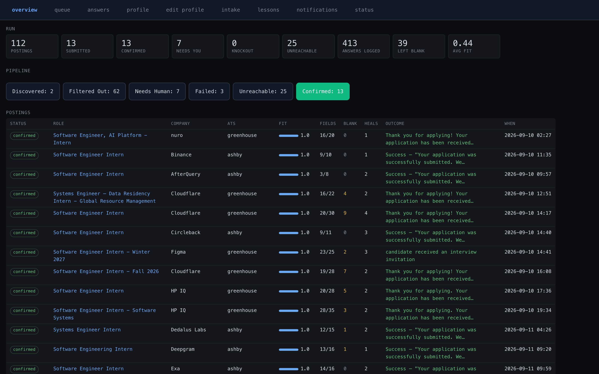

# jobbot

### ▶ [Watch the demo](https://www.loom.com/share/b6030369547844788e7d24a78eda02ec)

[](https://www.loom.com/share/b6030369547844788e7d24a78eda02ec)

**You spend 3 hours filling out applications. The bot spends 3 hours doing it right.**

An autonomous job application agent that finds roles, reads each one, tailors your resume, answers every screening question, fills the form, verifies its work against the actual page, and submits—then shows you exactly what it said in your name.

It never makes anything up. Legally binding questions come only from your profile. If something's missing, it tells you which question and stops.

---

## How It Works

**Stage 1: Discovery & Filtering (Free)**
- Find jobs from Greenhouse, Lever, Ashby, Workday, LinkedIn, or any ATS
- Filter out ghosts and jobs you can't win
- Rank by fit

**Stage 2: Check the Form (Cheap)**
- Open the application form
- Parse every required field
- Detect which ATS you're dealing with
- Return a list of screening questions you need to answer

**Stage 3: Verify You Can Answer (Stop if You Can't)**
- For every screening question, check: do I have this answer in my profile?
- If yes, keep going. If no, stop and tell you which question is missing.
- This prevents wasted work. No resumé tailored for a form you can't complete.

**Stage 4: Do the Work (Expensive)**
- Build a portfolio repo (real GitHub repo, real commits)
- Tailor your resumé per role
- Render to 1-page PDF (enforced by measurement)
- Fill every form field
- Verify it looks right before submitting
- Check post-submit for confirmation

**Why this order?** A published run generated 2,019 tailored resumés just to make 112 submissions. Because it tailored before discovering the form needed an account it couldn't create. This tool doesn't.

---

## Setup (60 Seconds)

```bash
# Install
uv sync

# Configure
cp .env.example .env                              # add ANTHROPIC_API_KEY
cp config/profile.example.yaml config/profile.yaml   # fill with your info

# Verify
uv run jobbot check

# Run (dry run — fills forms, doesn't submit)
uv run jobbot run --source greenhouse:anthropic --limit 3
```

Full setup including Gmail and GitHub: [docs/SETUP.md](docs/SETUP.md)

---

## What It Actually Does

**Connects to real job boards.** Not scraping. Real APIs:
- Greenhouse, Lever, Ashby, SmartRecruiters, Workable, Workday
- LinkedIn via JobSpy (resolves back to company career sites)
- GitHub (creates real portfolios with real commits)
- Gmail (for email verification codes)

**Sees what you see.** Screenshots at scroll position, accessibility tree, label resolution. Doesn't put phone numbers in name fields.

**Three checkpoints, not one click.** Parse the form → fill it → verify it looks right → wait for confirmation. Silent success is the dominant failure mode. A click isn't proof. Only a confirmation message is.

**Knows what you know.** Resumé tailored per role using only your experience, skills you've listed, numbers from your bullets, your own phrasing. Every tailored resumé is diffed against your profile. Unknown employer? Blocked. Skill you didn't list? Blocked.

---

## The Dashboard



| View | What You Get |
|------|---|
| **Overview** | Pipeline: discovered, filtered, applied, confirmed |
| **Queue** | Tick jobs to apply to. Blacklist ones you're doing manually. |
| **Answers** | Every statement made in your name. Why. How confident. |
| **Profile** | Your identity, experience, screening answers. Edit live. |
| **Status** | Readiness: LLM? GitHub? Gmail? API endpoints. What each ATS taught us. |

---

## What Makes This Different

1. **Legal safety first.** No guessing on visa sponsorship, background checks, criminal history, or work authorization. If you didn't tell it, it doesn't say it.

2. **Cost ordering.** Expensive work (resumé tailoring, portfolio building) only happens after we know the form is real and reachable.

3. **Three verification checkpoints.** Parse → fill → verify → confirm. Not "we clicked submit so you're applied."

4. **Real integrations.** Greenhouse, Lever, Ashby, Workday, GitHub, Gmail. All live.

5. **Portfolio per role.** Real GitHub repository with real commits demonstrating your skills. Not a template.

---

## Architecture

See [docs/ARCHITECTURE.md](docs/ARCHITECTURE.md) for:
- Why the form layer never sees raw DOM
- Why we capture tiles instead of full screenshots
- Why three checkpoints matter
- Cost ordering rationale

---

## For the Hackathon

**Multi-App AI Agent Hackathon** (Lemma + Comma Capital, judged by Arga Labs)

**Integrations:** 7 services (5 ATS + GitHub + Gmail)

---

## License

MIT. See [NOTICE.md](NOTICE.md).
